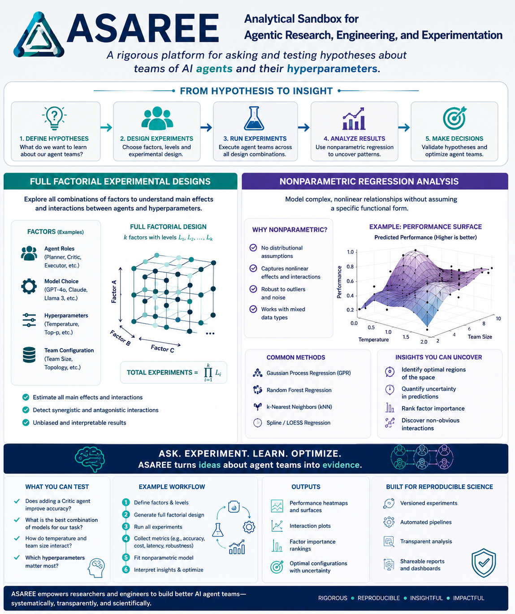

# ASAREE — Vision

**ASAREE: Analytical Sandbox for Agentic Research, Engineering, and Experimentation.**

> A rigorous platform for asking and testing hypotheses about teams of AI
> agents and their hyperparameters.

## From hypothesis to insight

1. **Define hypotheses** — what do we want to learn about our agent teams?
2. **Design experiments** — choose factors, levels, and experimental design.
3. **Run experiments** — execute agent teams across all design combinations.
4. **Analyze results** — use nonparametric regression to uncover patterns.
5. **Make decisions** — validate hypotheses and optimize agent teams.

## Full factorial experimental designs

Explore all combinations of factors to understand main effects and
interactions between agents and hyperparameters.

Example factors:

- **Agent roles** (Planner, Critic, Executor, etc.)
- **Model choice** (GPT-4o, Claude, Llama 3, etc.)
- **Hyperparameters** (Temperature, Top-p, etc.)
- **Team configuration** (Team size, topology, etc.)

A full factorial design over *k* factors with levels *L₁, L₂, …, Lₖ* runs
`∏ᵢ Lᵢ` total experiments.

- Estimate all main effects and interactions
- Detect synergistic and antagonistic interactions
- Unbiased and interpretable results

## Nonparametric regression analysis

Model complex, nonlinear relationships between factors and performance
without assuming a specific functional form.

Why nonparametric:

- No distributional assumptions
- Captures nonlinear effects and interactions
- Robust to outliers and noise
- Works with mixed data types

Common methods:

- Gaussian Process Regression (GPR)
- Random Forest Regression
- k-Nearest Neighbors (kNN)
- Spline / LOESS Regression

Insights this can uncover:

- Identify optimal regions of the space
- Quantify uncertainty in predictions
- Rank factor importance
- Discover non-obvious interactions

## What you can test

- Does adding a Critic agent improve accuracy?
- What is the best combination of models for our task?
- How do temperature and team size interact?
- Which hyperparameters matter most?

## Example workflow

1. Define factors & levels
2. Generate full factorial design
3. Run all experiments
4. Collect metrics (e.g., accuracy, cost, latency, robustness)
5. Fit nonparametric model
6. Interpret insights & optimize

## Outputs

- Performance heatmaps and surfaces
- Interaction plots
- Factor importance rankings
- Optimal configurations with uncertainty

## Built for reproducible science

- Versioned experiments
- Automated pipelines
- Transparent analysis
- Shareable reports and dashboards

---

**Ask. Experiment. Learn. Optimize. ASAREE turns ideas about agent teams into
evidence.** ASAREE empowers researchers and engineers to build better AI agent
teams — systematically, transparently, and scientifically.

*Rigorous · Reproducible · Insightful · Impactful*

---

## Status against this vision

See `project_plan/core_asaree_use_case.md` in the ARES repo for the current,
concrete build status. As of this writing: ASAREE provides the primitives
(agents, runs, credentials, MCP tools, dataset/workspace lineage, and a
factorial-results ledger) but does not yet provide "design experiments"
(factor/level → design-matrix generation) or "analyze results" (nonparametric
regression / performance surfaces) as ASAREE features — the spinal_surgery use
case currently performs both of those itself, outside ASAREE, against ASAREE's
lower-level primitives. See that document's "Vision gap" section for the
sequencing decision.
